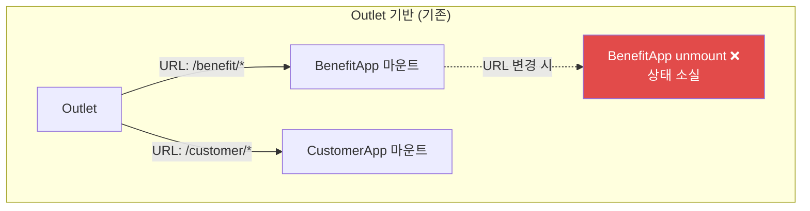

## 프로젝트 개요

케이뱅크의 서비스 관리를 위한 어드민 포털을 처음부터 설계하고 구축하는 프로젝트입니다.
Turborepo 기반 모노레포로 구성하여 여러 패키지의 코드 공유와 빌드 최적화를 달성했습니다.

## 1. Turborepo 기반 모노레포 아키텍처

### 모노레포를 선택한 이유

관리자 포털은 여러 서비스 도메인의 관리 기능을 하나의 통합된 환경에서 제공해야 합니다.
각 도메인별 앱을 독립적으로 개발하면서도 공통 UI 컴포넌트, 유틸리티, 타입 정의 등을 효율적으로 공유하기 위해
모노레포 구조를 채택했습니다.

<HighlightBox type="info" title="모노레포 구성">
- **apps/**: 각 서비스 도메인별 관리자 앱
- **packages/ui**: MUI 기반 디자인 시스템 컴포넌트
- **packages/config**: ESLint, TypeScript, Vite 공통 설정
- **packages/utils**: 공통 유틸리티 함수
</HighlightBox>

### Turborepo의 빌드 캐싱 활용

Turborepo의 Remote Caching을 활용하여 변경되지 않은 패키지는 빌드를 건너뛰고,
의존 관계가 있는 패키지만 선택적으로 재빌드함으로써 CI/CD 파이프라인의 실행 시간을 단축했습니다.

## 2. Module-Federation 구축


## 3. MDI(Multi Document Interface) 구현

### 문제 상황
#### 업무 흐름의 단절
어드민 애플리케이션 특성상, 여러 업무 화면을 한꺼번에 참고하면서 작업하는 경우가 많습니다. 하지만 하나의 화면만 볼 수 있도록 설계된 SPA 구조에서는 이런 방식이 어렵고, 그만큼 업무 효율도 떨어질 수밖에 없었습니다.

#### 단일 페이지 렌더링의 한계
기존 구조에서는 react-router의 `<Outlet />`을 이용해, URL에 따라 하나의 remote 앱만 화면에 그리는 방식이었습니다. 덕분에 메뉴를 이동할 때마다 이전 페이지는 곧바로 unmount되고, 이 과정에서 **폼에 입력한 값, 조회한 데이터, 각종 컴포넌트 상태가 모두 초기화** 문제가 발생했습니다.

```
기존 구조:
URL: /benefit/giftcard/media-management → MediaManagamentPage 마운트
URL: /customer/some-page                → MediaManagamentPage 언마운트 → CustomerSomePage 마운트

예를 들어, 사용자가 benefit 페이지에서 폼을 작성하다가
customer 페이지로 잠깐 이동했다가 돌아오면 → 입력 내용이 사라집니다.
```

#### MDI 탭내에서 화면 이동 시 화이트 페이지
LNB가 아닌, MDI Tab내에서 페이지 이동을 할 경우 해당 경로는 등록되지 않았다며 흰 페이지가 노출되었습니다.

### 원인 분석
#### 1) react-router Outlet의 근본적 한계

`<Outlet />`은 현재 URL에 따라 필요한 **컴포넌트 하나만 화면에 보여주는 구조**입니다. 새로운 URL로 이동하면 이전에 있던 컴포넌트는 React 트리에서 완전히 사라지고(unmount), 새로 필요한 컴포넌트만 흐름에 따라 다시 나타나게 됩니다.
즉, 한 번에 여러 컴포넌트를 유지할 수 없고, 항상 한 화면만 보여준다는 점이 설계 원칙입니다.
그래서 Outlet을 사용할 경우, 각 컴포넌트의 상태가 자연스럽게 유지되지 않는 한계가 있습니다.




## 4. MUI 기반 디자인 시스템

### Storybook을 활용한 컴포넌트 주도 개발

디자인 시스템의 각 컴포넌트를 Storybook으로 문서화하고 시각적으로 검증할 수 있는 환경을 구축했습니다.
MUI 테마 커스터마이징을 통해 케이뱅크의 브랜드 가이드라인에 맞는 일관된 UI를 제공합니다.

<HighlightBox type="success" title="디자인 시스템 효과">
- Storybook 기반의 시각적 컴포넌트 문서화로 디자이너-개발자 간 커뮤니케이션 비용 절감
- MUI 테마 커스터마이징을 통한 브랜드 일관성 확보
- Plop을 활용한 컴포넌트 보일러플레이트 자동 생성으로 DX 향상
</HighlightBox>

## 5. 테스트 환경 구축

Vitest를 활용하여 단위 테스트 환경을 구축하고, 핵심 비즈니스 로직과 유틸리티 함수에 대한 테스트를 작성합니다.
Turborepo의 파이프라인에 테스트를 통합하여 빌드 전 자동으로 테스트가 실행되도록 구성했습니다.
