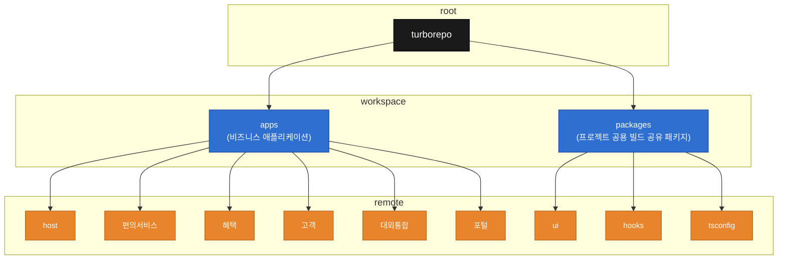
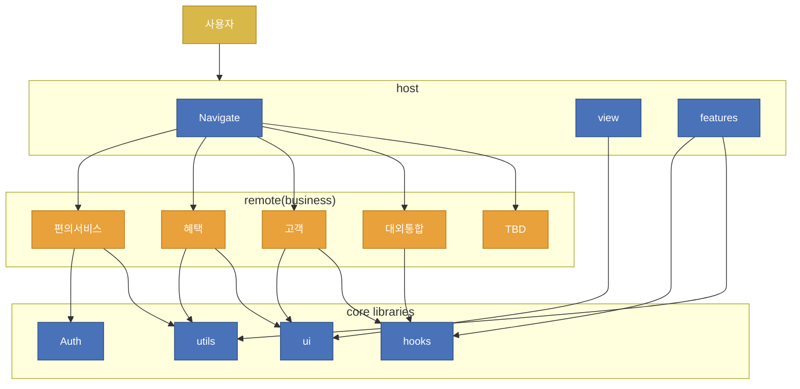
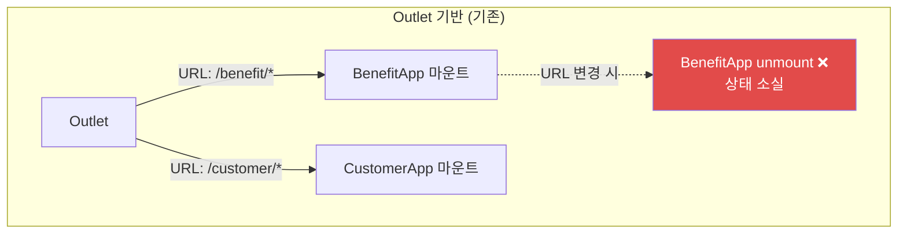

## 프로젝트 개요

케이뱅크의 서비스 관리를 위한 어드민 포털을 처음부터 설계하고 구축하는 프로젝트입니다.
Turborepo 기반 모노레포로 구성하여 여러 패키지의 코드 공유와 빌드 최적화를 달성했습니다.

## 수행업무
### 아키텍처 & 시스템 설계

- [**Module Federation**, **FSD**를 활용한 **모노레포** 프론트엔드 아키텍처 구성 설계](#1-turborepo-기반-모노레포-아키텍처)
- **Vite**, **Turborepo** 기반 개발 서버 구성 및 빌드 스크립트 구축
- 환경 변수, API 통신, 데이터 캐싱 및 캐시버스팅 등의 **개발 환경 설정**


### 공통 모듈 개발

- **Tanstack-Query** 기반 **데이터 캐싱 시스템** 구현
- **Axios** **기반 HTTP 클라이언트** 및 **인터셉터 시스템** 구현
- 보안 강화를 위한 **RSA 암복호화 유틸리티** 개발

### DX 개선
- **Vitest** 기반 테스팅을 도입하여 모듈의 안정성 확보

### UI/UX 컴포넌트 개발

- MUI 기반 재사용 가능한 **공통 컴포넌트 라이브러리** 구현
- 헤더, 사이드바 등 **공통 영역** 구현
- **plop**을 활용한 공통 컴포넌트, Storybook 생성 스크립트 작성


### [MDI(Multi Document Interface) 시스템 개발](#2-mdimulti-document-interface-구현)

- **Memory Router**를 활용한 모노레포 환경에서의 MDI 구현
- **Custom Navigation** 모듈을 생성하여 MDI 탭 내/외부 URL 동기화


### 로그인/로그아웃 & 세션 관리

- **브라우저 탭 간 회원정보 동기화** 및 실시간 공유
- 세션 만료 시간 알림 모달 구현

### 마스킹 시스템 구현

### 개발 지원 & 가이드

- **Confluence**를 활용한 개발가이드 작성 및 공유
    - **코딩 컨벤션 및 개발 표준** 수립
    - 리액트, 타입스크립트 등 **기술 교육 자료** 제작
    - 신규 화면 개발 가이드 작성
- **Storybook**을 통한 컴포넌트 **시각적 문서화 및 개발 가이드** 제공
- **API 모킹 시스템** 구축으로 백엔드 의존성 감소 및 병렬 개발 지원
- 프론트엔드 개발 지원


## 1. Turborepo 기반 모노레포 아키텍처

### 모노레포를 선택한 이유

- **다중 도메인 통합 및 병렬 개발 환경 구축**:
은행 시스템 내 여러 비즈니스 도메인을 단일 관리자 포털로 통합하고, 다수 팀이 간섭 없이 동시에 기능을 확장할 수 있도록 **모노레포(Monorepo) 아키텍처**를 설계 및 도입이 고려되었습니다.

- **독립성 보장 및 공통 자원 최적화**:
각 도메인별 애플리케이션의 **독립적인 개발을 보장**하면서도, 공통 UI 컴포넌트, 유틸리티, 타입 정의 등을 중복 없이 효율적으로 공유할 수 있는 시스템 구조를 설계하여 독립적인 개발 환경이 필요했습니다.

- **CI/CD 파이프라인 연계를 통한 운영 안정성 확보**:
KBank 가 보유한 자동화 파이프라인과 테스트 환경을 모노레포 구조에 활용하여, ‘개발-테스트-배포’로 이어지는 자동화 환경을 구성할 수 있었으므로, 모노레포 도입 비용이 절감될 것으로 판단했습니다.


### 모노레포 구현 방법

#### Turborepo(빌드 최적화 및 의존성 관리):
여러 도메인 앱과 공통 패키지 간의 의존성을 분석하고 관리하여, 순환참조 방지와 관리 효율을 높이기 위해 Turborepo를 도입했습니다. 또한 각 팀이 동시에 개발을 진행하는 과정에서 발생할 수 있는 빌드 병목 문제를 해소하기 위해, 병렬 작업과 캐싱 기능을 활용할 수 있는 점도 주된 선택 이유였습니다.

#### Module Federation(마이크로 프론트엔드 및 런타임 통합):
모노레포 환경에서 여러 팀이 하나의 코드베이스를 공유하더라도, 각 팀이 독립적으로 배포할 수 있는 구조를 만들고자 Module Federation을 적용했습니다. 런타임 시 브라우저 내 공통 라이브러리 중복 로드를 방지하는 **싱글톤** 기능을 활용할 수 있다는 것 또한 주된 선택 이유였습니다.


### 모노레포 패키지 구성
모노레포의 패키지 구성은 아래와 같습니다.<br/>
엄격한 계층 구조를 갖고 있으며 계층과 패키지 마다 명확한 기능과 책임을 갖도록 했습니다.

<HighlightBox type="info" title="모노레포 구성">
- **apps/**: 각 서비스 도메인별 관리자 앱
- **apps/host**: 각 서비스 도메인을 통합하는 햅
- **apps/[remote]**: 각 서비스 도메인별 관리자 앱
- **packages/ui**: MUI 기반 디자인 시스템 컴포넌트
- **packages/config**: ESLint, TypeScript, Vite 등 공통 설정
- **packages/utils**: 공통 유틸리티 함수
- **packages/...**: 그 외 애플리케이션 전역으로 사용되는 공통 모듈
</HighlightBox>

아래 그림과 같이 개별 서비스 모듈을 분리하여 **단일 프로젝트(모놀리식 구조)의 비대화를 방지**하도록 했습니다.
또한 Turborepo의 모듈 병렬 빌드와 서비스 별 단독 배포를 가능하게 하여 **빌드/배포 속도를 확보**할 수 있었습니다.

```mermaid
flowchart TD
    subgraph root
        turbo[turborepo]
    end

    subgraph workspace
        apps["apps<br/>(비즈니스 애플리케이션)"]
        packages["packages<br/>(프로젝트 공용 빌드 공유 패키지)"]
    end

    subgraph remote
        host[host]
        convenience[편의서비스]
        benefit[혜택]
        customer[고객]
        external-integration[대외통합]
        portal[포털]
        ui[ui]
        hooks[hooks]
        tsconfig[tsconfig]
    end

    turbo --> apps
    turbo --> packages

    apps --> host
    apps --> convenience
    apps --> benefit
    apps --> customer
    apps --> external-integration
    apps --> portal

    packages --> ui
    packages --> hooks
    packages --> tsconfig

    %% ── 클래스 정의 (fill=배경색, stroke=테두리, color=글씨색) ──
    classDef rootBox fill:#1a1a1a,stroke:#000,color:#fff,font-size:16px;
    classDef blueBox fill:#2f6fd0,stroke:#1a4a99,color:#fff,font-size:14px;
    classDef orangeBox fill:#e8842b,stroke:#b8631a,color:#fff,font-size:13px;

    %% ── 클래스 적용 ──
    class turbo rootBox;
    class apps,packages blueBox;
    class host,convenience,benefit,customer,external-integration,portal,ui,hooks,tsconfig orangeBox;
```

사용자가 애플리케이션 이용 시 호출되는 모듈 간의 계층 구조입니다.<br/>
host의 router는 각 리모트 패키지를 호출하여 각 애플리케이션을 실행합니다.<br/>
**packages**에 해당하는 공통 패키지 host, remotes 등 전역에서 사용됩니다.


```mermaid
flowchart TD
    user[사용자]

    subgraph host
        navigate[Navigate]
        view[view]
        features[features]
    end

    subgraph business["remote(business)"]
        convenience[편의서비스]
        benefit[혜택]
        customer[고객]
        external[대외통합]
        TBD[TBD]
    end

    subgraph libraries["core libraries"]
        auth[Auth]
        utils[utils]
        ui[ui]
        hooks[hooks]
    end

    user --> host

    navigate --> convenience
    navigate --> benefit
    navigate --> customer
    navigate --> external
    navigate --> TBD

    view --> ui
    features --> hooks
    features --> utils

    convenience --> auth
    convenience --> utils
    benefit --> utils
    benefit --> ui
    customer --> ui
    customer --> hooks
    external --> hooks

    classDef hostBox fill:#4a72b8,stroke:#2f4f80,color:#fff,font-size:14px;
    classDef bizBox fill:#e8a13b,stroke:#b87a1a,color:#fff,font-size:14px;
    classDef libBox fill:#4a72b8,stroke:#2f4f80,color:#fff,font-size:14px;
    classDef userBox fill:#d9b84a,stroke:#a8881a,color:#fff,font-size:14px;

    class user userBox;
    class navigate,view,features hostBox;
    class convenience,benefit,customer,external,TBD bizBox;
    class auth,utils,ui,hooks libBox;
```


## 2. MDI(Multi Document Interface) 구현

### 문제 상황
#### 업무 흐름의 단절
은행 관리자 애플리케이션 특성상, 여러 업무 화면을 한꺼번에 참고하면서 작업하는 경우가 많습니다. 하지만 한번에 하나의 화면만 볼 수 있도록 구현된 인터페이스에서는 업무 효율도 떨어질 수밖에 없었습니다.

#### 단일 페이지 렌더링의 한계
기존 구조에서는 react-router의 `<Outlet />`을 이용해, URL에 따라 하나의 remote 앱만 화면에 그리는 방식이었습니다. 덕분에 메뉴를 이동할 때마다 이전 페이지는 곧바로 unmount되고, 이 과정에서 **폼에 입력한 값, 조회한 데이터, 각종 컴포넌트 상태가 모두 초기화** 문제가 발생했습니다.

```
기존 구조:
URL: /benefit/giftcard/media-management → MediaManagamentPage 마운트
URL: /customer/some-page                → MediaManagamentPage 언마운트 → CustomerSomePage 마운트

예를 들어, 사용자가 benefit 페이지에서 폼을 작성하다가
customer 페이지로 잠깐 이동했다가 돌아오면 → 입력 내용이 사라집니다.
```

#### MDI 탭내에서 화면 이동 시 화이트 페이지
LNB가 아닌, MDI Tab내에서 페이지 이동을 할 경우 해당 경로는 등록되지 않았다며 흰 페이지가 노출되었습니다.

### 원인 분석
#### 1) react-router Outlet의 근본적 한계

`<Outlet />`은 현재 URL에 따라 필요한 **컴포넌트 하나만 화면에 보여주는 구조**입니다. 새로운 URL로 이동하면 이전에 있던 컴포넌트는 React 트리에서 완전히 사라지고(unmount), 새로 필요한 컴포넌트만 흐름에 따라 다시 나타나게 됩니다.
즉, 한 번에 여러 컴포넌트를 유지할 수 없고, 항상 한 화면만 보여준다는 점이 설계 원칙입니다.
그래서 Outlet을 사용할 경우, 각 컴포넌트의 상태가 자연스럽게 유지되지 않는 한계가 있습니다.


```mermaid
graph TD
    subgraph "Outlet 기반 (기존)"
        OL[Outlet] -->|"URL: /benefit/*"| BA[BenefitApp 마운트]
        OL -->|"URL: /customer/*"| CA[CustomerApp 마운트]
        BA -.->|URL 변경 시| UM["BenefitApp unmount ❌<br/>상태 소실"]
    end

    style UM fill:#E24B4A,color:#fff
```


## 3. 브라우저 간 세션 공유

### Storybook을 활용한 컴포넌트 주도 개발

디자인 시스템의 각 컴포넌트를 Storybook으로 문서화하고 시각적으로 검증할 수 있는 환경을 구축했습니다.
MUI 테마 커스터마이징을 통해 케이뱅크의 브랜드 가이드라인에 맞는 일관된 UI를 제공합니다.

<HighlightBox type="success" title="디자인 시스템 효과">
- Storybook 기반의 시각적 컴포넌트 문서화로 디자이너-개발자 간 커뮤니케이션 비용 절감
- MUI 테마 커스터마이징을 통한 브랜드 일관성 확보
- Plop을 활용한 컴포넌트 보일러플레이트 자동 생성으로 DX 향상
</HighlightBox>

## 4. 마스킹 기능 구현

Vitest를 활용하여 단위 테스트 환경을 구축하고, 핵심 비즈니스 로직과 유틸리티 함수에 대한 테스트를 작성합니다.
Turborepo의 파이프라인에 테스트를 통합하여 빌드 전 자동으로 테스트가 실행되도록 구성했습니다.
