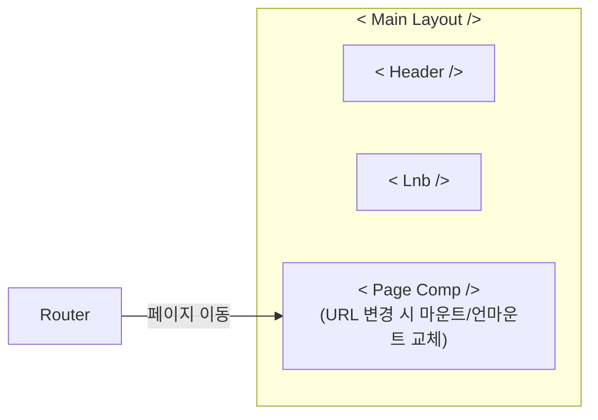
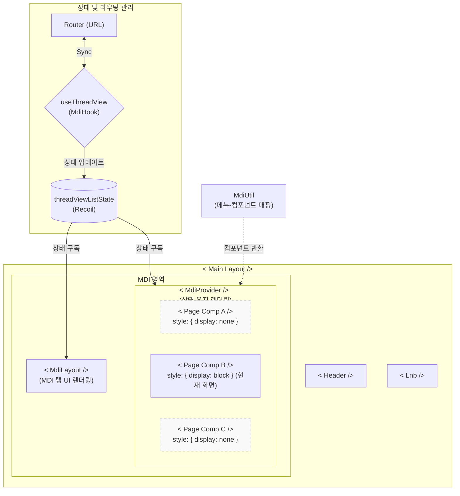
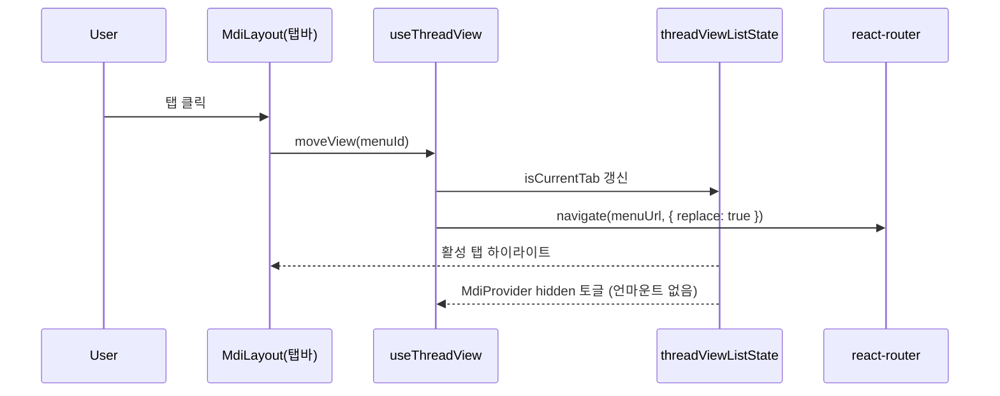

## 프로젝트 개요

SPC 간편결제(Pay 2.0) 서비스를 위한 결제 인프라 구축 및 채널(APP) 서비스, Admin 시스템을 개발했습니다. S9머니, 오픈뱅킹을 통한 충전, 해피포인트 전환, BC카드 및 선불카드 연계 서비스 등을 통해 로컬 및 글로벌 결제 플랫폼의 기반을 마련하였으며, F&B 업계 최초의 FinTech 결제 플랫폼 서비스로 그룹 이미지를 제고하는 데 기여했습니다.

## 수행업무
### 공통 영역 개발

- 헤더, 사이드바 등 **공통 UI 요소 구현 및 관리**
- 재사용 가능한 **공통 컴포넌트** 개발 (모달, 다이얼로그, 테이블 등)
- 프로젝트 빌드 및 배포 프로세스 관리
- 프론트엔드 개발 지원 및 기술 문제 해결

### 관리자 페이지

- 헤더, 사이드바 등 공통영역 개발
- **Recoil**을 활용한 **MDI(Multi Document Interface)** 시스템 구현
- **sheet-js**와 **xlsx-polulate** 라이브러리를 활용한 클라이언트 사이드 엑셀 변환 기능 개발

### 모바일 웹뷰 개발

- **크로스 브라우징 대응** (Chrome, Safari)
- 웹뷰-모바일 앱 간 **브릿지 함수** 개발 (홈버튼, 뒤로가기 등)
- **Webpack** 설정을 통한 React SPA에서 **MPA**로의 아키텍처 전환
- 인터랙티브 UI 요소 개발 지원 (스와이퍼, 툴팁, 애니메이션)
- **Gulp** 를 활용한 **정적 자원 최적화 시스템 구축**

## 1. MDI(Multi Document Interface) 시스템 개발
### 문제상황
#### 업무 흐름의 단절
관리자 업무 특성상, 여러 업무 화면을 한꺼번에 참고하면서 작업하는 경우가 많습니다. 하지만 한번에 하나의 화면만 볼 수 있도록 구현된 인터페이스에서는 기존 화면의 검색조건과 데이터가 초기화된다는 점에서 업무 효율 측면에서 치명적이었습니다.

#### 기존 코드 변경 및 마이그레이션 비용
MDI 시스템 도입 결정이 프로젝트 후반부에 이루어졌기에, 동료 개발자들이 이미 완성해 둔 화면 코드를 대대적으로 수정하는 일은 피해야 했습니다. 즉, 각자 담당한 기능에서 발생하는 코드 변경을 최소화하고, 기존 아키텍처를 최대한 유지하면서 새로운 MDI 환경에 자연스럽게 통합될 수 있는 유연한 설계가 필수적이었습니다.

이런 이유 때문에 브라우저 탭처럼 여러 페이지를 띄워놓고 자유롭게 이동하되, 각 화면의 상태(State)가 그대로 유지되는 MDI 환경 구축이 필요했습니다.

### 해결 방안
#### 페이지 렌더링 방식 변경
기존의 react-router 구조에서 Recoil 전역 상태와 react-router를 연동하는 방식으로 페이지 렌더링 방식을 변경했습니다.

1. **기존 라우터 구조**: 페이지 이동 시 컴포넌트가 교체되며 기존 상태가 날아가는 기존의 한계를 보여주는 구조입니다.

2. **MDI 아키텍처 구조**: Recoil 상태와 Router를 동기화(Sync)하고, display 속성을 통해 렌더링 상태를 유지하는 핵심 로직을 표현한 구조입니다.

#### 상태 유지 렌더링(MdiProvider)  
- 열린 탭의 컴포넌트는 모두 마운트된 상태를 유지하며, 단지 `hidden` 속성으로 표시만 바꿔주도록 했습니다. 이 방식 덕분에 탭을 전환해도 언마운트가 일어나지 않아 폼 입력값, 그리드 스크롤 위치, 조회 조건 등 사용하던 상태가 그대로 남아있게 되었습니다.
- 전체 탭을 계속 마운트하는 데 따른 메모리 부담은 최대 탭 수를 20개로 제한하여 충분히 관리하도록 했습니다.

#### 탭과 라우터의 동기화 (useThreadView)
- 열린 탭 목록은 Recoil의 전역 상태인 `threadViewListState`로 일원화해 관리하게 했습니다. 이 덕분에 탭바(MdiLayout)와 렌더러(MdiProvider) 모두 동일한 상태를 구독하며 각 컴포넌트가 항상 일관된 정보를 바탕으로 동작하게 했습니다.
- 탭을 추가하거나 전환, 혹은 닫을 때마다 `navigate(url, { replace: true })`를 사용해 라우터 상태와 실시간으로 동기화 되도록 했습니다. 
    - `replace: true`로 한 이유: 탭 전환이 별도의 히스토리 이벤트로 취급되지 않는 것이 자연스럽다고 판단해 이 방식을 택했습니다.
- 특히, URL 자체가 현재 활성화된 탭을 나타내기 때문에 새로고침이나 딥링크 상황에서도 사용자가 보고 있던 탭이 정확히 복원됩니다. URL과 UI가 일치하도록 설계하여, 사용성 향상과 복원성을 모두 잡고자 했습니다.

#### 탭 닫기 포커스 규칙 (removeView)  
- 활성화된 탭을 닫았을 때, 다음 탭이 있으면 그곳으로, 없으면 이전 탭, 둘 다 없을 때는 Home으로 자연스럽게 페이지가 이동합니다.  
- 브라우저의 기본 탭 사용 경험처럼 별도의 학습 없이 바로 익숙하게 쓸 수 있도록 UX 관성을 그대로 반영했습니다.  

#### 탭바 인터랙션 (MdiLayout)  
- 외부 라이브러리 없이 HTML5의 Drag & Drop 기능만으로 탭 순서 변경을 구현했습니다.  
- 드래그 과정에서 동일 인덱스에 여러 번 이벤트가 발생하지 않도록 마지막 인덱스를 기억해 중복 처리를 방지했습니다.  
- 우클릭 시에는 컨텍스트 메뉴가 열리며, 해당 탭만 닫기, 다른 탭 모두 닫기, 전체 초기화와 같은 기능을 직관적으로 제공합니다.